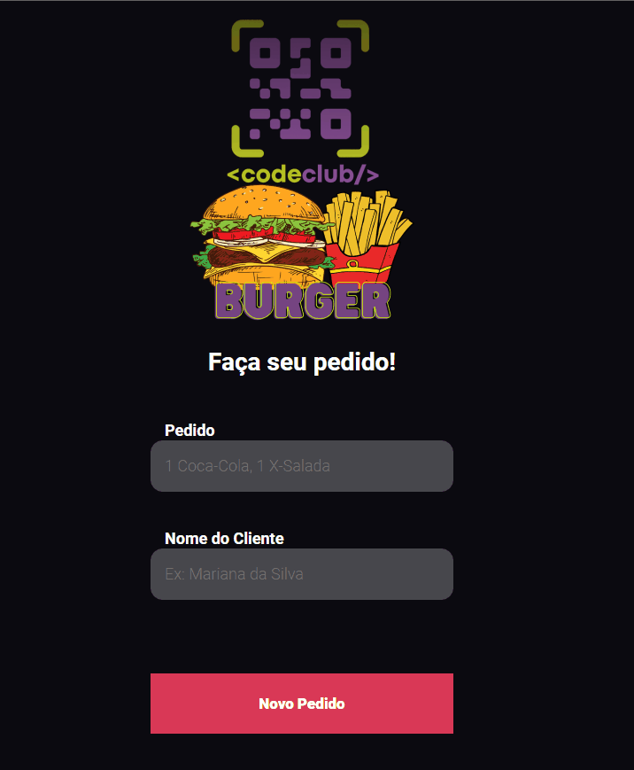

# Code Burger App

> Preencha os inputs com o pedido e o nome do cliente para cadastrar um novo pedido. Todos os pedidos vão ser mostrados na página seguinte. Você pode excluí-los clicando no ícone da lixeira.

## 🛠 Tecnologias Utilizadas

- React

- axios

- react-router-dom

- styled-components

- consumo da [API feita por mim](https://github.com/LuanaRSon/code-burger-api) em Node.js

  

## 💻 Pré-requisitos

Antes de começar, verifique se você atendeu aos seguintes requisitos:

* É bom ter um editor para trabalhar com o código ([VSCode](https://code.visualstudio.com/) é uma ótima opção);

* Ter o [Vite](https://vitejs.dev/guide/#browser-support) instalado;

* Ter pelo menos a versão 17 do [ReactJS](https://pt-br.reactjs.org/docs/getting-started.html) instalada.

  

## 🚀 Instalação

Para instalar o Code Burger App, siga estas etapas:

1. Clone este repositório;

   $ git clone <https://github.com/LuanaRSon/code-burger-app.git>

2. Acesse a pasta do projeto em seu terminal e rode o comando

   $ npm install ou $ yarn install

   para instalar as dependências do projeto;

3. Use o comando

   $ npm run dev ou $ yarn dev

   para iniciar o servidor na porta 3000;

4. Acesse http://localhost:3000/.

